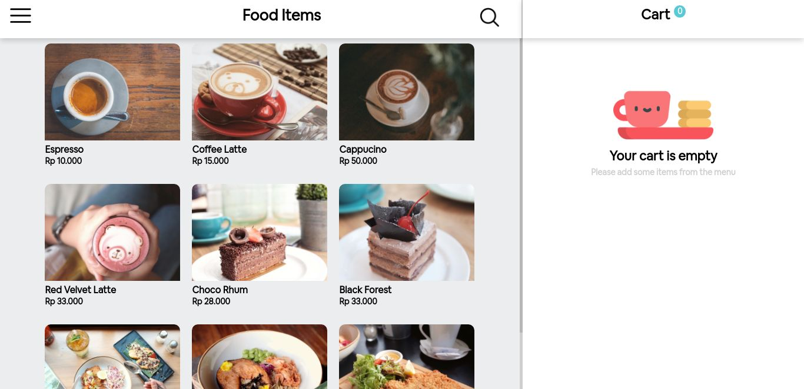
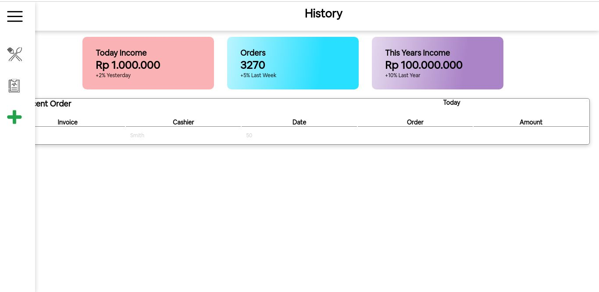

# POS App! Ordering Foods In No Time.

**POS App** is a website based application for ordering foods made with love for those who need to eat fancy foods and drinks anywhere and anytime.

## Built With

- [React.js](https://reactjs.org/)

## Installation

1. Clone the repo
   ```sh
   git clone https://github.com/ferdianfh/pos-app-reactjs.git
   ```
2. Install NPM packages
   ```sh
   npm install
   ```
3. Start the Application
   ```sh
   npm start
   ```

## Web Application Pages

Pages that currently available in **POS App**:

- **Home**, you can pick menu from this page, add it into cart, and process your order. You can also navigate to other pages.
- **History**, you can check your order history from this page.

## Snippets

Here are some snippets about this app:

- Home



- History



## POS App Update!

Hello there! **POS App** is currently in development process.

Last Update: Monday, 03/01/2022
